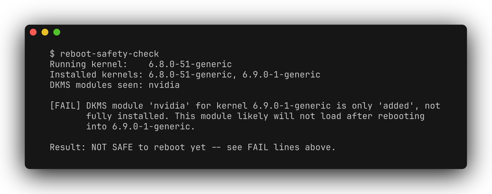

[](README.md) [](README.zh-CN.md)

# reboot-safety-check

A read-only Linux CLI for reviewing DKMS kernel-module problems after a kernel update, before rebooting. It looks for missing or incomplete module builds, missing kernel headers, and Secure Boot signing risks that can leave graphics, networking, or other out-of-tree drivers unavailable.



## Install

Requires Linux and Python 3.9+. The implementation uses the Python standard library and reads local system information.

```bash
git clone https://github.com/zhuhroscar-tech/reboot-safety-check.git
cd reboot-safety-check
python3 -m venv .venv
source .venv/bin/activate
python -m pip install .
```

Standalone `.pyz` packages are available from [GitHub Releases](https://github.com/zhuhroscar-tech/reboot-safety-check/releases); verify the release checksum before running a downloaded artifact. Release history is kept in [CHANGELOG.md](CHANGELOG.md).

## Usage

Run after your package manager installs a new kernel:

```bash
reboot-safety-check
reboot-safety-check --json
reboot-safety-check --no-color
```

Exit codes: **0** means no warning or failure was found, **1** means review warnings, and **2** means a failure was found. Read the findings before deciding to reboot: exit 0 is not a guarantee that the machine will boot successfully.

## What is checked

- Installed kernels in `/lib/modules` are compared with `uname -r`. Per-kernel checks target versions that sort newer than the running kernel, not every non-running kernel.
- `dkms status` is checked for registered modules and whether builds are fully installed. A module reported `installed` but with dkms's own "Diff between built and installed module" warning, reported `broken` (missing source directory), or never successfully built for any kernel at all (`added`, with no kernel-specific build ever completed), is called out specifically rather than folded into a generic warning or silently ignored.
- `dpkg-query` or `rpm` checks matching header packages when available.
- With Secure Boot enabled, `mokutil` checks enrolled Machine Owner Keys and `modinfo -k` looks for module signature fields.

These are best-effort checks. Signature fields do not prove that a signature matches an enrolled, trusted key. Missing tools, unrecognized output, or insufficient permissions can leave checks incomplete. If DKMS is unavailable or no entries are collected, there may be nothing to compare; do not interpret that as verification of all drivers. The tool does not validate the bootloader, initramfs, or the entire boot path.

It never installs modules, changes packages, signs or enrolls keys, or reboots. No network access or telemetry is used. Resolve findings through your distribution's normal maintenance process and keep a known-good fallback kernel.

## Development

```bash
python -m pip install -e '.[dev]'
python -m pytest -v
```

[Demo video](docs/demo.mp4) · [Release history](CHANGELOG.md) · [MIT license](LICENSE).
